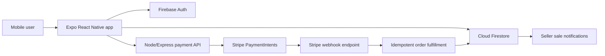

# Smart E-Commerce Showcase

Smart E-Commerce is a mobile marketplace app built with Expo and React Native. It lets users browse products, manage a cart, pay through Stripe PaymentSheet, list their own items for sale, and track buyer/seller deal activity in a dedicated workflow.

This public repository is a portfolio showcase. The production source code is private to protect backend implementation details, deployment configuration, and payment infrastructure.

## Highlights

- Cross-platform mobile app built with Expo, React Native, and TypeScript
- Firebase email/password authentication with verified-email guards
- Product browsing, search, product details, cart, and seller listing flows
- Stripe PaymentSheet checkout backed by server-side price, stock, and user validation
- Stripe webhook fulfillment with a server-confirmation fallback after successful payments
- Seller order approval workflow with sale notifications and shipped-state tracking
- Push notification registration and sale notification badge sync
- Firebase Crashlytics breadcrumbs and non-fatal reporting around sensitive app flows
- Localized UI across English, Turkish, Spanish, German, Italian, French, Russian, and Portuguese
- Unit coverage for currency helpers, cart reducer behavior, and payment service request/error handling

## Tech Stack

| Area | Tools |
| --- | --- |
| Mobile app | Expo, React Native, TypeScript |
| Navigation and state | React Navigation, Redux Toolkit, Redux Persist |
| Forms and validation | React Hook Form, Yup |
| Backend | Node.js, Express |
| Payments | Stripe React Native, Stripe PaymentIntents, Stripe webhooks |
| Cloud services | Firebase Auth, Cloud Firestore, Firebase Cloud Messaging, Crashlytics |
| Testing | Jest, jest-expo |
| Internationalization | i18next |

## Architecture

## Payment Design

Checkout is owned by the backend. The mobile client sends selected item IDs and an authenticated Firebase user token to the payment server. The server retrieves current product data from Firestore, validates stock, prevents self-purchases, calculates the final amount, and creates the Stripe PaymentIntent.

After PaymentSheet succeeds, the app asks the backend to confirm the payment with Stripe before writing the order. A Stripe webhook uses the same fulfillment path as a durable fallback, so order creation remains idempotent if the app closes or the network drops after payment.

## Reliability And Safety Notes

- Sensitive payment and Firebase service credentials live only on the server.
- Client-provided totals are not trusted for checkout.
- Fulfillment checks PaymentIntent metadata and stored checkout records before writing orders.
- Seller notifications are generated server-side after order fulfillment.
- Crashlytics events are used around checkout, authentication, product listing, and order approval paths.

## What I Built

I designed and implemented the app experience, state management, Firebase data flows, Stripe payment integration, webhook-based fulfillment path, localization setup, push notification flow, and production-oriented crash reporting.

## Source Availability

The full source repository is private because the project includes production backend behavior and deployment configuration. A code walkthrough or selected implementation samples can be shared on request.

## Author

Sinan Senkul  
GitHub: [SinanSenkul](https://github.com/SinanSenkul)
